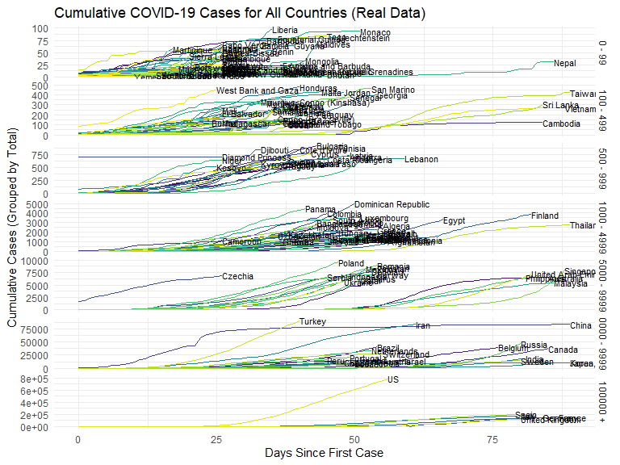
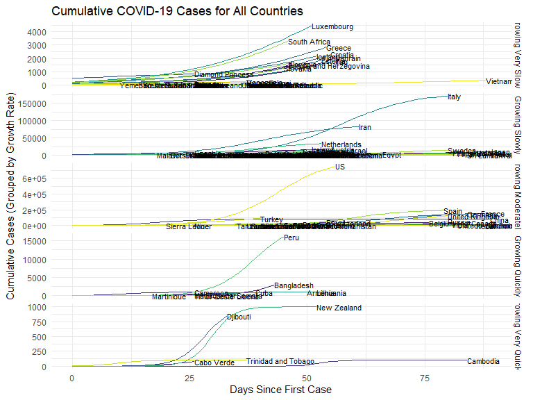
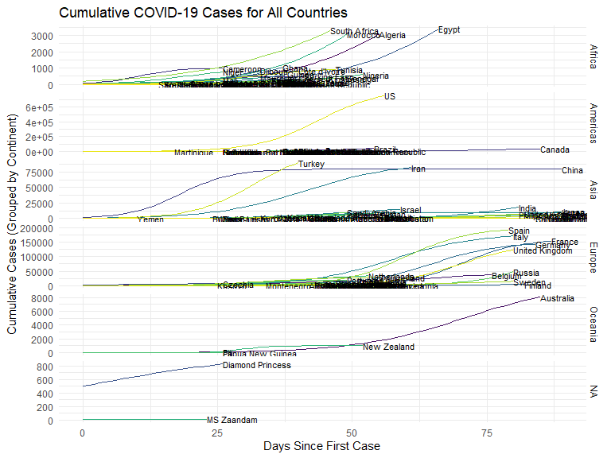
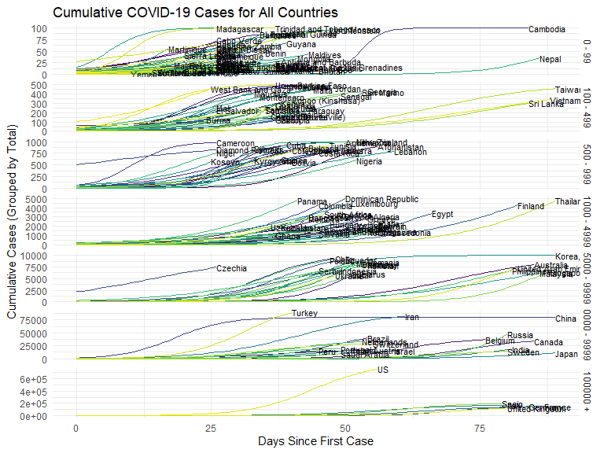
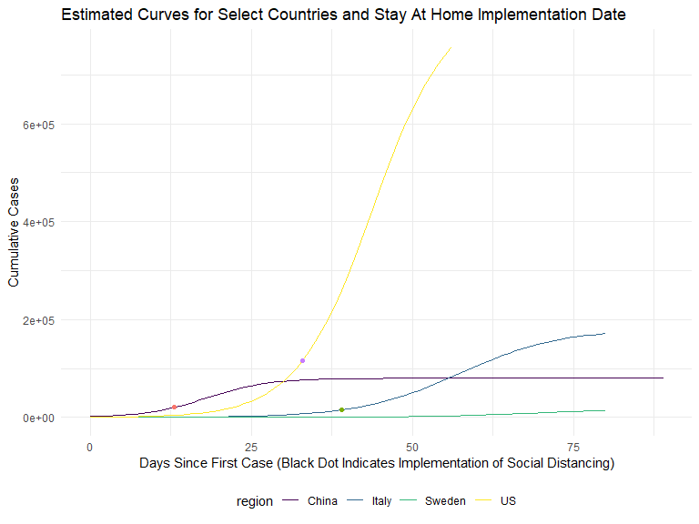
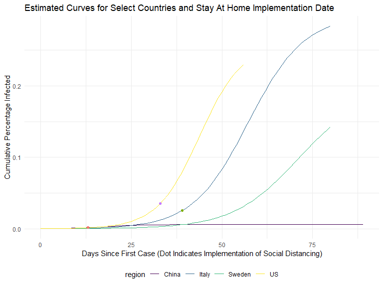
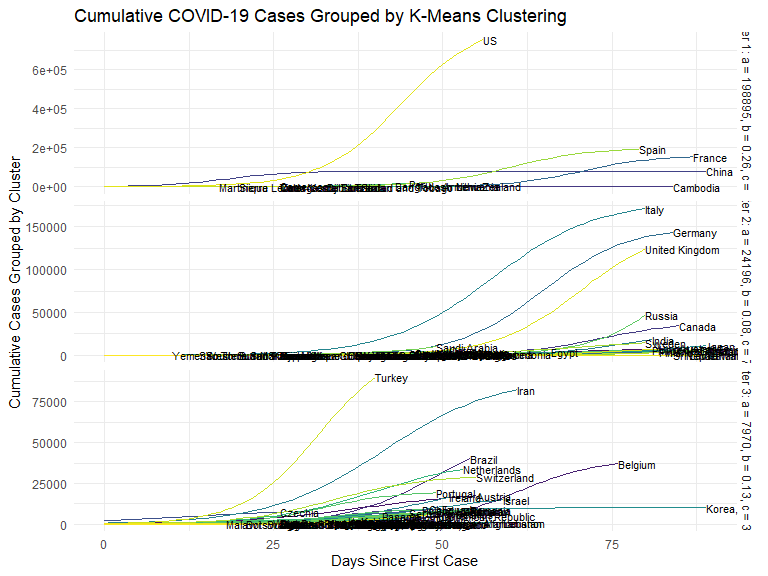
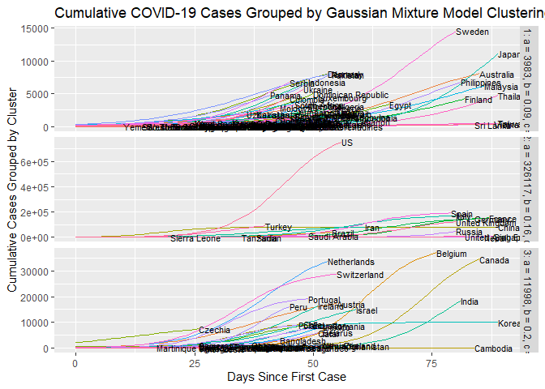

Visualizations
================
Adeline Shin
4/26/2020

# Load Data

``` r
load("./curves.RData")
```

# Plotting Original Data

``` r
real_df = by_country %>% 
  ungroup(country_region) %>% 
  mutate(
    group = replicate(length(by_country$country_region), 0)
  ) %>% 
  group_by(country_region) %>% 
  mutate(
    log_cases = log10(confirmed_cases),
    max_log = max(log_cases)
  ) %>% 
  dplyr::select(-log_cases) %>% 
  arrange(max_log) 

for (i in 1:length(real_df$country_region)) {
  if (real_df$max_log[i] < 2) {
    real_df$group[i] = "0 - 99"
  } else if (real_df$max_log[i] < log10(500)) {
    real_df$group[i] = "100 - 499"
  } else if (real_df$max_log[i] < 3) {
    real_df$group[i] = "500 - 999"
  } else if (real_df$max_log[i] < log10(5000)) {
    real_df$group[i] = "1000 - 4999"
  } else if (real_df$max_log[i] < 4) {
    real_df$group[i] = "5000 - 9999"
  } else if (real_df$max_log[i] < 5) {
    real_df$group[i] = "10000 - 99999"
  } else {
    real_df$group[i] = "100000 +"
  }
}

real_df$group = factor(real_df$group, levels = c("0 - 99", "100 - 499", "500 - 999", "1000 - 4999", "5000 - 9999", "10000 - 99999", "100000 +"), ordered = TRUE)

real_df %>% 
  ggplot(aes(x = t, y = confirmed_cases)) +
  geom_path(aes(color = country_region)) +
  facet_grid(group ~ ., scales = "free") +
  theme(legend.position = "none") +
  geom_dl(aes(label = country_region), method = list(dl.combine("last.points"), cex = 0.7)) +
  labs(
    title = "Cumulative COVID-19 Cases for All Countries (Real Data)",
    x = "Days Since First Case",
    y = "Cumulative Cases (Grouped by Total)"
  )
```

<!-- -->

``` r
ggsave("./visualizations/real_data_plotted.jpg", width = 12, height = 8)
```

# Plotting Estimates

## Plotting Top 20 Countries with Greatest Population

``` r
fitted_list_2 = as.data.frame(unlist(fitted_list)) %>% 
  janitor::clean_names() %>% 
  rownames_to_column(var = "country") %>% 
  mutate(
    t = as.numeric(gsub("[^[:digit:]]", "", country)) - 1,
    region = gsub("[[:digit:]]","", country)) %>% 
  dplyr::select(region, t, cases = unlist_fitted_list)

large_pop_list = c("China", "India", "US", "Indonesia", "Pakistan", "Brazil", "Nigeria", "Bangladesh", "Russia", "Mexico", "Japan", "Ethiopia", "Phillipines", "Egypt", "Vietnam", "Congo (Kinshasa)", "Turkey", "Iran", "Germany", "Thailand")

top_population = fitted_list_2 %>%
  filter(region %in% large_pop_list) %>% 
  ggplot(aes(x = t, y = cases)) +
  geom_path(aes(color = region)) +
  geom_dl(aes(label = region), method = list(dl.combine("last.points"), cex = 0.7)) +
  labs(
    title = "Cumulative COVID-19 Cases for Top 20 Countries in Population",
    x = "Days After First Case",
    y = "Cumulative Cases"
  )

ggsave("./visualizations/top_20_regions.jpg", plot = top_population, width = 12, height = 8)
```

## Plotting Top 20 Countries with Most Cases

``` r
top_names = fitted_list_2 %>% 
  group_by(region) %>% 
  mutate(max_cases = max(cases)) %>% 
  dplyr::select(region, max_cases) %>% 
  distinct() %>% 
  arrange(desc(max_cases)) %>% 
  head(20) %>% 
  dplyr::select(region)

top_names = as.tibble(top_names)
```

    ## Warning: `as.tibble()` is deprecated, use `as_tibble()` (but mind the new semantics).
    ## This warning is displayed once per session.

``` r
top_cases = fitted_list_2 %>%
  filter(region %in% top_names$region) %>% 
  ggplot(aes(x = t, y = cases)) +
  geom_path(aes(color = region)) +
  geom_dl(aes(label = region), method = list(dl.combine("last.points"), cex = 0.7)) +
  labs(
    title = "Cumulative COVID-19 Cases for Countries with Most Cases",
    x = "Days After First Case",
    y = "Cumulative Cases"
  )

ggsave("./visualizations/highest_cases.jpg", plot = top_cases, width = 12, height = 8)
```

## Plotting Countries Where Total is Still Growing

``` r
growing_df = fitted_list_2 %>% 
  full_join(param_df1, by = "region") 
  
for (i in 1:length(growing_df$region)) {
    if (growing_df$b[i] < 0.08) {
    growing_df$group[i] = "Growing Very Slowly"
  } else if (growing_df$b[i] < 0.15) {
    growing_df$group[i] = "Growing Slowly"
  } else if (growing_df$b[i] < 0.22) {
    growing_df$group[i] = "Growing Moderately"
  } else if (growing_df$b[i] < 0.32) {
    growing_df$group[i] = "Growing Quickly"
  } else {
    growing_df$group[i] = "Growing Very Quickly"
  }
}

growing_df$group = factor(growing_df$group, levels = c("Growing Very Slowly", "Growing Slowly", "Growing Moderately", "Growing Quickly", "Growing Very Quickly"), ordered = TRUE)

growing_df %>% 
  ggplot(aes(x = t, y = cases)) +
  geom_path(aes(color = region)) +
  facet_grid(group ~ ., scales = "free") +
  theme(legend.position = "none") +
  geom_dl(aes(label = region), method = list(dl.combine("last.points"), cex = 0.7)) +
  labs(
    title = "Cumulative COVID-19 Cases for All Countries",
    x = "Days Since First Case",
    y = "Cumulative Cases (Grouped by Growth Rate)"
  )
```

<!-- -->

``` r
ggsave("./visualizations/growth_group_plot.jpg", width = 12, height = 8)
```

## Plotting Countries by Continent

``` r
continent_df = 
  fitted_list_2 %>% 
    mutate(
      continent = countrycode(sourcevar = fitted_list_2[, "region"],
                              origin = "country.name",
                              destination = "continent")
    )
```

    ## Warning in countrycode(sourcevar = fitted_list_2[, "region"], origin = "country.name", : Some values were not matched unambiguously: Diamond Princess, Kosovo, MS Zaandam

``` r
continent_df$continent[4320:4345] = "Europe"

continent_df %>% 
  ggplot(aes(x = t, y = cases)) +
  geom_path(aes(color = region)) +
  facet_grid(continent ~ ., scales = "free") +
  theme(legend.position = "none") +
  geom_dl(aes(label = region), method = list(dl.combine("last.points"), cex = 0.7)) +
  labs(
    title = "Cumulative COVID-19 Cases for All Countries",
    x = "Days Since First Case",
    y = "Cumulative Cases (Grouped by Continent)"
  )
```

<!-- -->

``` r
ggsave("./visualizations/covid_19_continents.jpg", width = 12, height = 8)
```

## Plotting Countries by Number of Cases

``` r
number_df = fitted_list_2 %>% 
  mutate(
    group = replicate(length(fitted_list_2$cases), 0)
  ) %>% 
  group_by(region) %>% 
  mutate(
    log_cases = log10(cases),
    max_log = max(log_cases)
  ) %>% 
  dplyr::select(-log_cases) %>% 
  arrange(max_log) 

for (i in 1:length(number_df$region)) {
  if (number_df$max_log[i] < 2) {
    number_df$group[i] = "0 - 99"
  } else if (number_df$max_log[i] < log10(500)) {
    number_df$group[i] = "100 - 499"
  } else if (number_df$max_log[i] < 3) {
    number_df$group[i] = "500 - 999"
  } else if (number_df$max_log[i] < log10(5000)) {
    number_df$group[i] = "1000 - 4999"
  } else if (number_df$max_log[i] < 4) {
    number_df$group[i] = "5000 - 9999"
  } else if (number_df$max_log[i] < 5) {
    number_df$group[i] = "10000 - 99999"
  } else {
    number_df$group[i] = "100000 +"
  }
}

number_df$group = factor(number_df$group, levels = c("0 - 99", "100 - 499", "500 - 999", "1000 - 4999", "5000 - 9999", "10000 - 99999", "100000 +"), ordered = TRUE)

number_df %>% 
  ggplot(aes(x = t, y = cases)) +
  geom_path(aes(color = region)) +
  facet_grid(group ~ ., scales = "free") +
  theme(legend.position = "none") +
  geom_dl(aes(label = region), method = list(dl.combine("last.points"), cex = 0.7)) +
  labs(
    title = "Cumulative COVID-19 Cases for All Countries",
    x = "Days Since First Case",
    y = "Cumulative Cases (Grouped by Total)"
  )
```

<!-- -->

``` r
ggsave("./visualizations/all_covid_cases.jpg", width = 12, height = 8)
```

## Differences in Stay at Home Orders

``` r
distancing_df = fitted_list_2 %>% 
  filter(region == "US" | region == "China" | region == "Italy" | region == "Sweden") %>% 
  mutate(population = rep(0, length(cases)))

for (i in 1:length(distancing_df$cases)) {
  if (distancing_df$region[i] == "US") {
    distancing_df$population[i] = 328200000
  } else if (distancing_df$region[i] == "China") {
    distancing_df$population[i] = 1393000000
  } else if (distancing_df$region[i] == "Italy" ) {
    distancing_df$population[i] = 60360000
  } else {distancing_df$population[i] = 10230000}
}

distancing_df = distancing_df %>% 
  mutate(
    percent_infected = (cases / population) * 100
  )

highlights = unlist(x = c(distancing_df[14, ], distancing_df[286, ], distancing_df[214, ]))

distancing_df %>% 
  ggplot(aes(x = t, y = cases)) +
  geom_path(aes(color = region)) +
  geom_point(data = distancing_df[14,], color = "#F8766D") +
  geom_point(data = distancing_df[286,], color = "#C77CFF") +
  geom_point(data = distancing_df[130,], color = "#7CAE00") +
  labs(
    title = "Estimated Curves for Select Countries and Stay At Home Implementation Date",
    x = "Days Since First Case (Black Dot Indicates Implementation of Social Distancing)",
    y = "Cumulative Cases"
  )
```

<!-- -->

``` r
ggsave("./visualizations/social_distancing.jpg", width = 12, height = 8)

distancing_df %>% 
  ggplot(aes(x = t, y = percent_infected)) +
  geom_path(aes(color = region)) +
  geom_point(data = distancing_df[14,], color = "#F8766D") +
  geom_point(data = distancing_df[286,], color = "#C77CFF") +
  geom_point(data = distancing_df[130,], color = "#7CAE00") +
  labs(
    title = "Estimated Curves for Select Countries and Stay At Home Implementation Date",
    x = "Days Since First Case (Dot Indicates Implementation of Social Distancing)",
    y = "Cumulative Percentage Infected"
  )
```

<!-- -->

``` r
ggsave("./visualizations/social_distancing_percentage.jpg", width = 12, height = 8)
```

# Plotting Clustering Results

## K means Clustering

``` r
kmeans_df = read_csv("./param_km3_final.csv") %>% 
  group_by(cluster) %>% 
  mutate(
    mean_a = round(mean(a), digits = 0),
    mean_b = round(mean(b), digits = 2),
    mean_c = round(mean(c), digits = 2)
  )
```

    ## Warning: Missing column names filled in: 'X1' [1]

    ## Parsed with column specification:
    ## cols(
    ##   X1 = col_double(),
    ##   a_std = col_double(),
    ##   b_std = col_double(),
    ##   c_std = col_double(),
    ##   region = col_character(),
    ##   a = col_double(),
    ##   b = col_double(),
    ##   c = col_double(),
    ##   cluster = col_double()
    ## )

``` r
kmeans_graphing_df = fitted_list_2 %>% 
  left_join(kmeans_df, by = "region") %>% 
  dplyr::select(region, t, cases, cluster)

labels = c(`1` = "Cluster 1: a = 198895, b = 0.26, c = 39.61", `2` = "Cluster 2: a = 24196, b = 0.08, c = 73.55", `3` = "Cluster 3: a = 7970, b = 0.13, c = 35.23")

kmeans_graphing_df %>% 
  ggplot(aes(x = t, y = cases)) +
  geom_path(aes(color = region)) +
  facet_grid(cluster ~ ., scales = "free", labeller = labeller(cluster = labels)) +
  theme(legend.position = "none") +
  geom_dl(aes(label = region), method = list(dl.combine("last.points"), cex = 0.7)) +
  labs(
    title = "Cumulative COVID-19 Cases Grouped by K-Means Clustering",
    x = "Days Since First Case",
    y = "Cumulative Cases Grouped by Cluster"
  )
```

<!-- -->

``` r
ggsave("./visualizations/kmeans_graph.jpg", width = 12, height = 12)
```

## Gaussian Clustering

``` r
gmm_df = read_csv("./param_gmm_final.csv") %>% 
  group_by(cluster) %>% 
  mutate(
    mean_a = round(mean(a), digits = 0),
    mean_b = round(mean(b), digits = 2),
    mean_c = round(mean(c), digits = 2)
  )
```

    ## Warning: Missing column names filled in: 'X1' [1]

    ## Parsed with column specification:
    ## cols(
    ##   X1 = col_double(),
    ##   a_std = col_double(),
    ##   b_std = col_double(),
    ##   c_std = col_double(),
    ##   region = col_character(),
    ##   a = col_double(),
    ##   b = col_double(),
    ##   c = col_double(),
    ##   cluster = col_double()
    ## )

``` r
gmm_graphing_df = fitted_list_2 %>% 
  left_join(gmm_df, by = "region") %>% 
  dplyr::select(region, t, cases, cluster)

labels_g = c(`1` = "Cluster 1: a = 3983, b = 0.09, c = 55.17", `2` = "Cluster 2: a = 326117, b = 0.16, c = 65.44", `3` = "Cluster 3: a = 11998, b = 0.2, c = 36.34")


gmm_graphing_df %>% 
  ggplot(aes(x = t, y = cases)) +
  geom_path(aes(color = region)) +
  facet_grid(cluster ~ ., scales = "free", labeller = labeller(cluster = labels_g)) +
  theme(legend.position = "none") +
  geom_dl(aes(label = region), method = list(dl.combine("last.points"), cex = 0.7)) +
  labs(
    title = "Cumulative COVID-19 Cases Grouped by Gaussian Mixture Model Clustering",
    x = "Days Since First Case",
    y = "Cumulative Cases Grouped by Cluster"
  )
```

<!-- -->

``` r
ggsave("./visualizations/gmm_graph.jpg", width = 12, height = 12)
```
